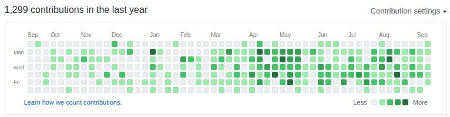

# Se tornando um desenvolvedor

Olá, Meu nome é Bruno Padilha e sou engenheiro de software.

Eu me formei em engenharia mecânica no final de 2018 e acabei ficando alguns meses sem conseguir emprego como engenheiro mecânico, com isso
acabei decidindo migrar para área de desenvolvimento de software. E muitos amigos acabam sempre me perguntando o que eu
fiz para começar a trabalhar com desenvolvimento.
Então decidi fazer este repositório para mostrar um roadmap para você se tornar um desenvolvedor até mesmo sem faculdade.

Lembre-se que cada um tem sua particularidade de vida e de assimilação de informação, pode ser que você demore mais ou menos do que eu demorei.

Lembre-se também que trabalhar com desenvolvimento de software não precisa só se amarrar em ficar no computador, é se amarrar em resolver problemas, mas com a linguagem do computador.

As dicas aqui vai estar focada em javascript que é a linguagem que eu me especializei.

## 0 - Dicas iniciais

### Participe de comunidades

Uma parada que eu acho absurdamente massa na área de desenvolvimento de software
é de você participar de comunidades de desenvolvimento, lá você
vai poder encontrar pessoas de diversas senioridades, conversar com elas e ver de perto para onde o mercado está tendendo a ir.
E aqui na [comunidades.tech](https://comunidades.tech/) é um repositório de comunidades espalhadas por todo o Brasil e você pode facilmente encontrar uma pertinho de você.

Também tem comunidades online e uma que eu indico demais é a [Impulso.network](https://impulser.me/Uexw0m) onde tem diversos meetups,
oportunidiades de empregos e chats de diversas linguagens para você tirar dúvidas.

### Github

Faça um [github](https://github.com) logo no primeiro dia dos seus estudos e coloque exatamente tudo lá. Github é uma ferramenta de versionamento de código usado por quase todas as empresas e vai ser muito importante você saber usar.
Além disso, lá é uma "rede social" de códigos, onde recrutadores e outros desenvolvedores vão poder ver seus códigos e vai ser uma espécie de currículo para você,você vai ver que cada dia que você coloca um código lá
vai preencher o dia com um quadradinho verde como mostrado na imagem abaixo, isso vai mostrar que pelo menos você tem alguma experiência codando.
[Aqui](https://www.udemy.com/course/git-e-github-para-iniciantes/) você pode fazer um curso gratuito de Git e Github para iniciantes.

### Canais youtube

Você vai encontrar bastante material no youtube, que fala sobre tecnologia, códigos e muito mais. Não exite em se inscrever e começar a consumir os conteúdos.

Estes são os canais que eu sigo:

- [Filipe Deschamps](https://www.youtube.com/channel/UCU5JicSrEM5A63jkJ2QvGYw)
- [Lucas Montano](https://www.youtube.com/channel/UCyHOBY6IDZF9zOKJPou2Rgg)
- [Programador BR](https://www.youtube.com/channel/UCrdgeUeCll2QKmqmihIgKBQ)
- [Rocketseat](https://www.youtube.com/channel/UCSfwM5u0Kce6Cce8_S72olg)
- [Impulso Network](https://www.youtube.com/channel/UChfPxID6Mi1GL3-o4ede6Ew)

## 1 - Começando com o básico

Eu acabo sempre indicando muito começar pelo material totalmente **GRATUITO** do Curso em
vídeo [Curso em vídeo](https://www.youtube.com/user/cursosemvideo), mais precisamente no curso de [Javascript](https://www.youtube.com/playlist?list=PLHz_AreHm4dlsK3Nr9GVvXCbpQyHQl1o1) que vai te dar uma base
maneira do que vai vir pela frente na sua vida, como funciona o desenvolvimento de um site e tudo mais.
 
Eles também tem outros cursos muito legais como o de [algoritmos e lógica de programação](https://www.youtube.com/watch?v=8mei6uVttho&list=PLtcmVcOuK65yUfMiVHiNCmKaAk3n333d9&ab_channel=CursoemV%C3%ADdeo) e também indico bastante o curso de
[python](https://www.youtube.com/watch?v=S9uPNppGsGo&list=PLvE-ZAFRgX8hnECDn1v9HNTI71veL3oW0).

Quando estiver se sentindo confortável, vá tentando fazer os desafios do [hackerrank](https://www.hackerrank.com/dashboard).

## 2 - Aprofundando um pouco mais

Agora que passou da etapa inicial, é imprescindível que você pegue uns conceitos
mais a fundo sobre orientação a objetos, arrays e métodos e indico muito
o material da [cod3r](https://www.cod3r.com.br/), mais precisamente o curso de
Web Moderno, encontrado [aqui](https://www.udemy.com/course/curso-web/)
na udemy. Aqui você vai pegar conceitos massas que vai usar sempre, é um ótimo
repositório para você poder olhar sempre que tiver dúvidas.

Você também pode usar estes dois sites para usar como pesquisa/estudos, que são: [w3schools.com](https://www.w3schools.com/) e o [developer.mozilla](https://developer.mozilla.org/pt-BR/docs/Web).

## 3 - Agora é para valer

### Bootcamp

Bootcamps são cursos onde você vai fazer em um determinado tempo, geralmente 3 meses, bastante puxado mas que você vai estudar e vai chegar bem perto do que é colocado em prática,
sei que são relativamente caros, ainda mais se você estiver desempregado, mas vale muito a pena, tendo em vista do cashback que você vai ter quando conseguir um emprego,
um bootcamp que eu indico muito que sai por volta dos R$ 2000,00 ~ R$ 3000,00 é o da [Rocketseat](https://rocketseat.com.br/) que foi o que eu fiz e valeu muito a pena, lá você vai aprender: Node (backend), React (frontend) e React-native (app).
Sem falar que

Até hoje no dia dia do meu trabalho utilizo coisas que aprendi com eles, mas claro que você vai ter que continuar aprendendo depois de concluir.

### Cursos

Caso seja muito caro para sua renda, pode também estar fazendo cursos mais em conta e que valem demais como o da [Origamid](https://www.origamid.com/), que é muito voltado para o frontend e design.
E também sempre vi feedbacks bacanas do [React.js Ninja](https://www.udemy.com/course/curso-reactjs-ninja/?src=sac&kw=react).

### Faculdade

Acho super válido fazer uma faculdade de sistemas de informação, ciencias da computação ou engenharia de software,
principalmente para fazer network, mas faculdade vai durar alguns anos da sua vida.

Tem um repositório que sou apaixonado, que é de um cara que juntou todos os cursos **GRATUITOS** de faculdades no exterior e ela completa uma grade de uma faculdade de
ciência da computação que é este [aqui](https://github.com/ossu/computer-science). E também é uma boa oportunidade de ir aprimorando seu inglês.

## 4 - Roadmap

Quando eu estava começando a estudar, eu tentava bastante seguir esse [roadmap](https://github.com/kamranahmedse/developer-roadmap) que vai te mostrar uma ideia para você ser um desenvolvedor completo.
Depois de estudar esses cursos que indiquei, você vai notar que preencheu bastante esse caminho.

## 5 - E as vagas?

Lugares que eu acho muito massa de procurar vagas é no [Linkedin](https://www.linkedin.com/feed/) e no [Programathor](https://programathor.com.br/jobs).

No github também pode encontrar bastante vaga como no [react-brasil/vagas](https://github.com/react-brasil/vagas) e no [backend-br/vagas](https://github.com/backend-br/vagas/issues).
E também tem esses dois que eu conheço de vagas remotas como o [remote-jobs](https://github.com/remoteintech/remote-jobs) e o [awesome-remote-job](https://github.com/lukasz-madon/awesome-remote-job).

## 6 - Enquanto não consegue emprego

Enquanto você não consegue emprego, não desanime, coloque em prática tudo que você sabe ajudando em projetos open-source, faça [desafios](https://github.com/felipefialho/frontend-challenges) de vagas de emprego e vai subindo aqui no github
e postando no linkedin, alguma hora alguém vai conseguir te notar e você ja vai estar praticando bastante seus conhecimentos.
